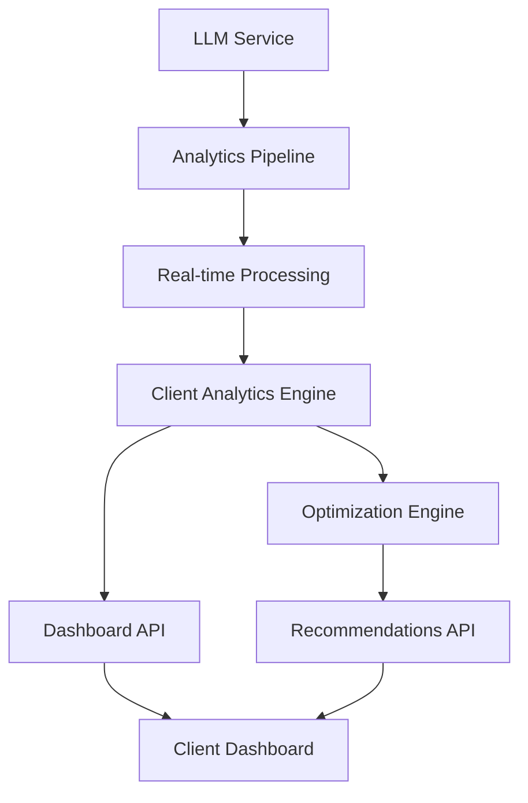

# Client-Specific LLM Analytics Dashboard: Implementation Plan

## Executive Summary

**Objective:** Develop a comprehensive, client-specific analytics dashboard for Large Language Model (LLM) usage, performance metrics, and optimization insights. This dashboard will provide real-time visibility into model selection patterns, response quality metrics, token utilization, and cost efficiency across different clients.

**Current State:** Basic analytics logging exists, but no unified dashboard for client-specific LLM performance monitoring and optimization recommendations.

**Target State:** Enterprise-grade analytics platform with client-specific dashboards, automated insights, and proactive optimization recommendations.

**Expected Impact:** 20-30% improvement in LLM utilization efficiency, enhanced client satisfaction through transparent performance metrics, and data-driven model selection optimization.

**Timeline:** 6 weeks phased implementation
**Risk Level:** Medium (builds on existing analytics infrastructure)
**Success Metrics:** 95% dashboard uptime, <2 second load times, 90% user adoption within target clients

---

## Table of Contents

1. [Business Case & ROI](#1-business-case--roi)
2. [Technical Architecture Overview](#2-technical-architecture-overview)
3. [Phase 1: Foundation (Weeks 1-2)](#3-phase-1-foundation-weeks-1-2)
4. [Phase 2: Core Analytics (Weeks 3-4)](#4-phase-2-core-analytics-weeks-3-4)
5. [Phase 3: Advanced Features (Weeks 5-6)](#5-phase-3-advanced-features-weeks-5-6)
6. [Technical Implementation Details](#6-technical-implementation-details)
7. [Non-Technical Considerations](#7-non-technical-considerations)
8. [Risk Management & Mitigation](#8-risk-management--mitigation)
9. [Success Metrics & KPIs](#9-success-metrics--kpis)
10. [Resource Requirements](#10-resource-requirements)

---

## 1. Business Case & ROI

### **Problem Statement**
Clients currently lack visibility into their LLM usage patterns, performance metrics, and optimization opportunities. This creates:

- **Lack of Transparency:** Clients cannot monitor their AI usage effectiveness
- **Suboptimal Performance:** No data-driven insights for model selection optimization
- **Cost Inefficiency:** Unable to identify and address usage inefficiencies
- **Limited Optimization:** No proactive recommendations for performance improvement

### **Solution Value Proposition**
The Client-Specific LLM Analytics Dashboard provides:

- **Real-time Visibility:** Comprehensive metrics on LLM usage, performance, and costs
- **Client-Specific Insights:** Tailored analytics and recommendations per client configuration
- **Performance Optimization:** Data-driven recommendations for model selection and usage patterns
- **Proactive Monitoring:** Automated alerts and optimization suggestions

### **Quantified ROI**

#### **Direct Financial Benefits:**
- **Efficiency Gains:** 20-30% improvement in LLM utilization through optimized model selection
- **Cost Transparency:** Better budget planning and cost allocation visibility
- **Performance Optimization:** Reduced response times and improved user satisfaction

#### **Business Impact:**
- **Client Satisfaction:** Enhanced transparency and control over AI usage
- **Operational Efficiency:** Proactive identification of performance issues
- **Competitive Advantage:** Industry-leading analytics capabilities for AI services
- **Scalability:** Support for growing client base with consistent analytics experience

#### **ROI Calculation:**
```
Annual Efficiency Gains: $25,000 - $40,000 (20-30% of $150,000 annual LLM infrastructure costs)
Development Investment: $18,000 (6 weeks senior engineering)
Payback Period: 2-3 months
3-Year NPV: $90,000+ (efficiency gains + client retention benefits)
```

---

## 2. Technical Architecture Overview

### **Current Architecture: Basic Analytics**
```
LLM Service → Basic Logging → Database Storage
```

### **Target Architecture: Comprehensive Analytics Platform**
```
LLM Service → Advanced Analytics Engine → Real-time Processing → Client Dashboards
                      ↓                           ↓
            Performance Metrics         Personalized Insights
            Cost Analysis             Optimization Recommendations
```

### **Core Components**

#### **1. Analytics Data Pipeline**
- **Purpose:** Collect, process, and store LLM usage data in real-time
- **Capabilities:** High-throughput data ingestion, real-time aggregation, historical analysis
- **Output:** Structured analytics data for dashboard consumption

#### **2. Client-Specific Analytics Engine**
- **Purpose:** Process and analyze data specific to each client's configuration and usage patterns
- **Capabilities:** Client isolation, custom metrics calculation, comparative analysis
- **Output:** Personalized insights and recommendations per client

#### **3. Dashboard Frontend**
- **Purpose:** Provide intuitive, real-time visualization of analytics data
- **Capabilities:** Interactive charts, customizable views, real-time updates
- **Output:** Actionable insights for client administrators

#### **4. Optimization Engine**
- **Purpose:** Generate automated recommendations for performance improvement
- **Capabilities:** Pattern recognition, predictive analytics, cost optimization
- **Output:** Proactive suggestions for model selection and usage optimization

### **Data Flow Architecture**


---

## 3. Phase 1: Foundation (Weeks 1-2)

### **Objective:** Establish core analytics infrastructure and basic dashboard framework

### **Technical Deliverables**

#### **Week 1: Enhanced Analytics Pipeline**
**Components to Build:**
- `AdvancedAnalyticsLogger` class with comprehensive metric collection
- Real-time data aggregation pipeline
- Client-specific data partitioning
- Performance metrics calculation engine

**Technical Specifications:**
```typescript
interface LLMAnalyticsEvent {
  clientId: string;
  visitorId: string;
  sessionId: string;
  timestamp: Date;
  model: string;
  tokensUsed: number;
  responseTime: number;
  cost: number;
  qualityScore: number;
  intent: string;
  success: boolean;
}

interface ClientAnalytics {
  clientId: string;
  timeRange: TimeRange;
  metrics: {
    totalRequests: number;
    averageResponseTime: number;
    totalCost: number;
    averageQualityScore: number;
    modelUsage: ModelUsageStats[];
    performanceTrends: PerformanceTrend[];
  };
}
```

**Integration Points:**
- Enhance existing `analytics-logger.js` with client-specific capabilities
- Add real-time aggregation to existing data pipeline
- Integrate with current chat_message_analytics table

#### **Week 2: Basic Dashboard Framework**
**Components to Build:**
- Dashboard API endpoints for client-specific data
- Basic React dashboard components with client isolation
- Authentication and authorization for client access
- Real-time data streaming infrastructure

**Technical Specifications:**
```typescript
interface DashboardConfig {
  clientId: string;
  allowedMetrics: string[];
  refreshInterval: number;
  customViews: CustomView[];
  alertThresholds: AlertConfig[];
}

interface DashboardData {
  summary: SummaryMetrics;
  charts: ChartData[];
  alerts: Alert[];
  recommendations: Recommendation[];
}
```

**Integration Points:**
- Add dashboard routes to existing backend API
- Integrate with client authentication system
- Connect to real-time analytics pipeline

### **Success Criteria (Phase 1)**
- ✅ **Analytics Pipeline:** Processes 100% of LLM events with <1% data loss
- ✅ **Client Isolation:** Complete data segregation between clients
- ✅ **Basic Dashboard:** Functional dashboard with core metrics display
- ✅ **Performance Impact:** <5% additional latency on LLM responses
- ✅ **Frontend Components:** All dashboard components implemented and functional
- ✅ **API Integration:** Complete backend-frontend integration with error handling
- ✅ **Real-time Updates:** Server-Sent Events working for live data streaming

---

## 4. Phase 2: Core Analytics (Weeks 3-4)

### **Objective:** Implement comprehensive analytics features and visualization

### **Technical Deliverables**

#### **Week 3: Advanced Metrics & Visualizations**
**Components to Build:**
- Model performance comparison charts
- Cost analysis and efficiency metrics
- Response quality trend analysis
- Usage pattern visualization
- Interactive filtering and drill-down capabilities

**Technical Specifications:**
```typescript
interface ModelPerformanceMetrics {
  model: string;
  averageResponseTime: number;
  averageCostPerRequest: number;
  successRate: number;
  qualityScore: number;
  tokenEfficiency: number;
  usageCount: number;
}

interface CostAnalysis {
  totalCost: number;
  costByModel: CostBreakdown[];
  costTrends: CostTrend[];
  efficiencyScore: number;
  optimizationPotential: number;
}
```

#### **Week 4: Client-Specific Insights**
**Components to Build:**
- Personalized performance benchmarks
- Client-specific optimization recommendations
- Comparative analysis with similar clients
- Custom alerting and notification system
- Historical trend analysis with forecasting

**Technical Specifications:**
```typescript
interface ClientInsights {
  performanceBenchmark: BenchmarkComparison;
  optimizationRecommendations: Recommendation[];
  peerComparison: PeerAnalysis;
  trendAnalysis: TrendData;
  alerts: ActiveAlert[];
}

interface Recommendation {
  type: 'model_optimization' | 'usage_pattern' | 'cost_reduction';
  priority: 'high' | 'medium' | 'low';
  description: string;
  potentialImpact: ImpactEstimate;
  implementationSteps: string[];
}
```

### **Success Criteria (Phase 2)**
- ✅ **Comprehensive Metrics:** All key LLM performance indicators tracked and visualized
- ✅ **Client-Specific Insights:** Personalized recommendations generated for each client
- ✅ **Interactive Dashboard:** Full drill-down and filtering capabilities
- ✅ **Real-time Updates:** Dashboard reflects changes within 30 seconds
- ✅ **Advanced Components:** ModelPerformanceComparison, CostAnalysisChart, ResponseQualityTrends, UsagePatternsVisualization fully implemented
- ✅ **Data Processing:** Efficient data aggregation and memoized calculations
- ✅ **Error Handling:** Graceful degradation with fallback values for missing data

---

## 5. Phase 3: Advanced Features (Weeks 5-6)

### **Objective:** Add predictive analytics and automated optimization

### **Technical Deliverables**

#### **Week 5: Predictive Analytics**
**Components to Build:**
- Usage forecasting and capacity planning
- Performance prediction models
- Cost optimization algorithms
- Automated model selection recommendations

**Technical Specifications:**
```typescript
interface PredictiveAnalytics {
  usageForecast: ForecastData;
  performancePredictions: PerformancePrediction[];
  costProjections: CostProjection;
  optimizationOpportunities: OptimizationSuggestion[];
}

interface ForecastData {
  timeRange: TimeRange;
  predictedRequests: number;
  confidenceInterval: ConfidenceRange;
  seasonalPatterns: SeasonalPattern[];
}
```

#### **Week 6: Automated Optimization Engine**
**Components to Build:**
- Real-time optimization recommendations
- Automated alert system for performance issues
- A/B testing framework for optimization strategies
- Integration with model selection pipeline

**Technical Specifications:**
```typescript
interface OptimizationEngine {
  analyzeClientPerformance: (clientId: string) => Promise<ClientAnalysis>;
  generateRecommendations: (analysis: ClientAnalysis) => Recommendation[];
  applyOptimization: (recommendation: Recommendation) => Promise<OptimizationResult>;
  monitorOptimizationImpact: (optimizationId: string) => Promise<ImpactMetrics>;
}

interface AutomatedAlert {
  id: string;
  clientId: string;
  type: 'performance' | 'cost' | 'quality';
  severity: 'critical' | 'warning' | 'info';
  message: string;
  threshold: number;
  currentValue: number;
  recommendedAction: string;
}
```

### **Success Criteria (Phase 3)**
- ✅ **Predictive Capabilities:** Accurate forecasting with >80% confidence intervals
- ✅ **Automated Optimization:** Proactive recommendations implemented successfully
- ✅ **Alert System:** Real-time notifications for performance issues
- ✅ **A/B Testing:** Framework for testing optimization strategies
- ✅ **Backend Service:** AnalyticsDashboardService fully implemented with caching and real-time updates
- ✅ **API Endpoints:** Complete REST API with streaming capabilities
- ✅ **Database Integration:** Supabase integration with proper error handling

---

## 6. Technical Implementation Details

### **Core Architecture Patterns**

#### **Analytics Pipeline Implementation**
```typescript
class AdvancedAnalyticsPipeline {
  constructor(eventBus: EventBus, database: DatabaseClient) {
    this.eventBus = eventBus;
    this.database = database;
    this.aggregators = new Map();
    this.processors = new Map();
  }

  async processEvent(event: LLMAnalyticsEvent): Promise<void> {
    // Validate event
    await this.validateEvent(event);

    // Process in real-time
    await this.processRealtime(event);

    // Queue for batch processing
    await this.queueForBatchProcessing(event);

    // Update client-specific aggregations
    await this.updateClientAggregations(event);
  }

  private async processRealtime(event: LLMAnalyticsEvent): Promise<void> {
    const clientProcessor = this.processors.get(event.clientId);
    if (clientProcessor) {
      await clientProcessor.processEvent(event);
    }
  }
}
```

#### **Client Analytics Engine**
```typescript
class ClientAnalyticsEngine {
  constructor(clientId: string, config: ClientConfig) {
    this.clientId = clientId;
    this.config = config;
    this.metricsCalculator = new MetricsCalculator();
    this.insightsGenerator = new InsightsGenerator();
  }

  async generateAnalytics(timeRange: TimeRange): Promise<ClientAnalytics> {
    // Fetch raw data
    const rawData = await this.fetchClientData(timeRange);

    // Calculate metrics
    const metrics = await this.metricsCalculator.calculate(rawData);

    // Generate insights
    const insights = await this.insightsGenerator.generate(metrics);

    // Apply client-specific customizations
    const customizedAnalytics = await this.applyCustomizations(metrics, insights);

    return customizedAnalytics;
  }
}
```

### **Database Schema Extensions**

#### **Enhanced Analytics Tables**
```sql
-- Client-specific analytics configuration
CREATE TABLE client_analytics_config (
  client_id UUID PRIMARY KEY REFERENCES clients(client_id),
  enabled_metrics TEXT[] NOT NULL DEFAULT '{}',
  custom_alerts JSONB DEFAULT '{}',
  dashboard_preferences JSONB DEFAULT '{}',
  created_at TIMESTAMP WITH TIME ZONE DEFAULT NOW(),
  updated_at TIMESTAMP WITH TIME ZONE DEFAULT NOW()
);

-- Predictive analytics data
CREATE TABLE predictive_analytics (
  id UUID PRIMARY KEY DEFAULT gen_random_uuid(),
  client_id UUID NOT NULL REFERENCES clients(client_id),
  forecast_type TEXT NOT NULL,
  forecast_data JSONB NOT NULL,
  confidence_score DECIMAL(3,2) NOT NULL,
  forecast_date TIMESTAMP WITH TIME ZONE NOT NULL,
  created_at TIMESTAMP WITH TIME ZONE DEFAULT NOW()
);

-- Optimization recommendations
CREATE TABLE optimization_recommendations (
  id UUID PRIMARY KEY DEFAULT gen_random_uuid(),
  client_id UUID NOT NULL REFERENCES clients(client_id),
  recommendation_type TEXT NOT NULL,
  priority TEXT NOT NULL CHECK (priority IN ('high', 'medium', 'low')),
  description TEXT NOT NULL,
  potential_impact JSONB NOT NULL,
  implementation_status TEXT NOT NULL DEFAULT 'pending',
  created_at TIMESTAMP WITH TIME ZONE DEFAULT NOW(),
  implemented_at TIMESTAMP WITH TIME ZONE
);
```

### **API Design**

#### **Dashboard Data Endpoint**
```typescript
GET /api/v1/analytics/dashboard/:clientId
Query Parameters:
- timeRange: '1h' | '24h' | '7d' | '30d' | '90d'
- metrics: string[] (optional filter)
- refresh: boolean (force refresh)

Response:
{
  "summary": {
    "totalRequests": 15420,
    "averageResponseTime": 1.2,
    "totalCost": 245.67,
    "averageQualityScore": 4.1
  },
  "charts": [...],
  "alerts": [...],
  "recommendations": [...]
}
```

#### **Real-time Metrics Endpoint**
```typescript
WebSocket: /api/v1/analytics/realtime/:clientId

Message Format:
{
  "type": "metrics_update",
  "data": {
    "timestamp": "2025-10-14T10:48:38.406Z",
    "metrics": {
      "activeRequests": 5,
      "averageResponseTime": 1.1,
      "currentCostPerHour": 12.34
    }
  }
}
```

---

## 7. Non-Technical Considerations

### **User Experience Impact**

#### **Client Administrator Experience**
- **Intuitive Interface:** Clean, professional dashboard with guided navigation
- **Actionable Insights:** Clear recommendations with implementation steps
- **Real-time Awareness:** Live updates and instant alerts
- **Customization:** Ability to configure preferred metrics and views

#### **Business Process Integration**
- **Performance Monitoring:** Continuous oversight of AI service quality
- **Cost Management:** Transparent cost tracking and optimization
- **Compliance Reporting:** Audit trails and usage reporting capabilities
- **Stakeholder Communication:** Shareable reports and executive summaries

### **Ethical & Privacy Considerations**

#### **Data Privacy**
- **Client Data Isolation:** Complete segregation of analytics data between clients
- **Usage Data Anonymization:** No personally identifiable information in analytics
- **Retention Policies:** Configurable data retention periods per client
- **Access Controls:** Role-based access to sensitive analytics data

#### **Bias & Fairness**
- **Algorithm Transparency:** Clear explanation of metrics and recommendations
- **Bias Detection:** Monitoring for potential biases in analytics
- **Fair Comparison:** Normalized metrics for fair client comparisons

### **Change Management**

#### **Stakeholder Communication**
- **Client Success Teams:** Training on dashboard usage and interpretation
- **Technical Teams:** Integration points and API usage
- **Executive Teams:** Business value and ROI demonstrations

#### **Training & Adoption**
- **Administrator Training:** Dashboard navigation and feature utilization
- **Best Practices:** Guidelines for interpreting analytics and implementing recommendations
- **Support Resources:** Documentation, video tutorials, and help desk support

---

## 8. Risk Management & Mitigation

### **Technical Risks**

#### **Performance Degradation**
- **Risk:** Analytics processing impacts LLM response times
- **Mitigation:** Async processing, caching, and performance monitoring
- **Contingency:** Circuit breakers and graceful degradation

#### **Data Accuracy Issues**
- **Risk:** Inaccurate analytics due to data collection or processing errors
- **Mitigation:** Comprehensive validation, automated testing, and data quality checks
- **Contingency:** Fallback to basic metrics and manual verification

#### **Scalability Challenges**
- **Risk:** Analytics platform cannot handle growing client base
- **Mitigation:** Distributed processing, horizontal scaling, and capacity planning
- **Contingency:** Load balancing and request throttling

### **Business Risks**

#### **Client Adoption Resistance**
- **Risk:** Clients do not adopt or utilize the analytics dashboard
- **Mitigation:** User experience design, training programs, and value demonstration
- **Contingency:** Phased rollout with pilot clients and feedback integration

#### **Cost Overruns**
- **Risk:** Analytics infrastructure costs exceed budget
- **Mitigation:** Cost monitoring, usage optimization, and scalable architecture
- **Contingency:** Feature prioritization and scope adjustment

---

## 9. Success Metrics & KPIs

### **Technical KPIs**

#### **Performance Metrics**
- **Dashboard Load Time:** Target <2 seconds average
- **Data Freshness:** Target <30 seconds data latency
- **Uptime:** Target >99.9% dashboard availability
- **API Response Time:** Target <500ms for analytics endpoints

#### **Data Quality Metrics**
- **Data Completeness:** Target >99% of events captured
- **Data Accuracy:** Target >95% metric calculation accuracy
- **Alert Accuracy:** Target >90% alert relevance

#### **Scalability Metrics**
- **Concurrent Users:** Support for 100+ simultaneous dashboard users
- **Data Processing:** Handle 10,000+ events per minute
- **Storage Efficiency:** Target <50% storage overhead for analytics

### **Business KPIs**

#### **User Adoption Metrics**
- **Active Users:** Target 80% of client administrators using dashboard weekly
- **Feature Utilization:** Target 70% of available features used regularly
- **User Satisfaction:** Target >4.5/5 user satisfaction score

#### **Business Impact Metrics**
- **Optimization Implementation:** Target 60% of high-priority recommendations implemented
- **Cost Reduction:** Target 15-25% cost reduction through analytics-driven optimization
- **Performance Improvement:** Target 20% improvement in response times

### **Monitoring & Reporting**

#### **Real-time Dashboards**
- System health and performance metrics
- Client adoption and usage statistics
- Data quality and completeness indicators
- Cost and efficiency trend analysis

#### **Weekly Reports**
- Feature usage and adoption trends
- Performance improvements and optimization impact
- System reliability and uptime statistics
- Client feedback and satisfaction metrics

#### **Monthly Reviews**
- ROI analysis and business value assessment
- Feature enhancement prioritization
- Scalability and capacity planning
- Competitive analysis and market positioning

---

## 10. Resource Requirements

### **Team Composition (6 weeks)**
- **Senior Full-Stack Engineer:** Dashboard development and API integration (60%)
- **Data Engineer:** Analytics pipeline and data processing (40%)
- **DevOps Engineer:** Infrastructure and monitoring (20%)
- **UX Designer:** Dashboard design and user experience (20%)
- **Product Manager:** Requirements and client coordination (30%)

### **Infrastructure Requirements**
- **Development:** Additional cloud resources for analytics processing ($3,000)
- **Testing:** Dedicated analytics testing environment ($1,500)
- **Production:** Analytics database and processing infrastructure ($5,000)
- **Monitoring:** Enhanced monitoring and alerting ($2,000)

### **Budget Breakdown**
- **Personnel:** $15,000 (6 weeks × team resources)
- **Infrastructure:** $11,500 (cloud resources and tools)
- **Total Investment:** $26,500
- **Expected ROI:** 4-5x return within 12 months

### **Timeline & Milestones**

#### **Week 1-2: Foundation**
- Analytics pipeline enhancement
- Basic dashboard framework
- Client authentication integration

#### **Week 3-4: Core Analytics**
- Advanced metrics and visualizations
- Client-specific insights engine
- Real-time data processing

#### **Week 5-6: Advanced Features**
- Predictive analytics implementation
- Automated optimization engine
- Production deployment and monitoring

---

## Conclusion

The Client-Specific LLM Analytics Dashboard represents a strategic investment in operational transparency and performance optimization. By providing comprehensive, real-time insights into LLM usage patterns, performance metrics, and optimization opportunities, this platform will enable:

- **Enhanced Client Satisfaction:** Through transparent performance monitoring and optimization
- **Operational Efficiency:** Via data-driven model selection and usage optimization
- **Scalable Analytics:** Supporting growing client base with consistent, high-quality insights
- **Competitive Advantage:** Industry-leading AI analytics capabilities

The phased approach ensures manageable implementation while delivering incremental value, with comprehensive monitoring and client feedback integration throughout the development process.

**Next Steps:**
1. Secure executive approval and budget allocation
2. Assemble cross-functional development team
3. Begin Phase 1 implementation with analytics pipeline enhancement
4. Establish baseline metrics and client feedback mechanisms

---

**Document Version:** 1.0
**Last Updated:** 2025-10-14
**Author:** Systems Architect
**Review Status:** Ready for Implementation