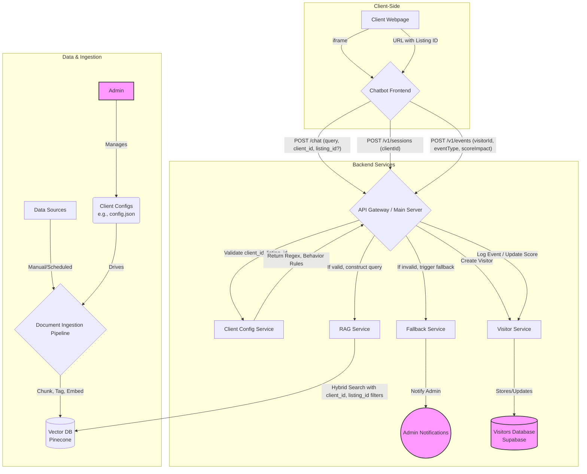

# System Architecture

## Overview
The application is a multi-tenant, enterprise-grade RAG (Retrieval-Augmented Generation) system designed to be sold as a service to different clients. It is architected as a monorepo with a Node.js backend and a React frontend.

- **Backend:** `packages/backend`
- **Frontend:** `packages/frontend` (includes the embeddable chat widget and will house the client dashboard)
- **Test Harness:** `packages/test-harness`

## Multi-Tenant Backend Architecture
The backend is a Node.js application using Express.js. Its primary responsibility is to serve a highly-configurable, multi-tenant RAG pipeline and manage client-specific configurations.

### Core Principles:
- **Multi-Tenancy by Default:** Every service is designed around a `client_id`. Data, configurations, and behavior are strictly partitioned by client.
- **Configuration as Code:** Each client has a dedicated JSON configuration file defining their specific setup, including chatbot behavior, prompt instructions, data ingestion rules, and frontend settings. This enables version control and an easy transition to a future admin UI.
- **Modular Ingestion:** A flexible document ingestion pipeline allows for creating custom tagging and chunking workflows for each client's unique data sources.

### Core Components:
- **`src/index.js` (API Gateway):** The main entry point. It validates `client_id` on all incoming requests and routes them to the appropriate services.
- **Client Configuration Service:** A new service that loads and serves client-specific configurations from JSON files. This governs everything from URL pattern matching for context extraction to fallback behavior.
- **`src/rag-service.js` (RAG Service):** Executes the RAG pipeline.
  - **Context-Filtered Retrieval:** It performs a **Hybrid Search** that is strictly filtered by `client_id` and, when available, `listing_id` or other context-specific tags.
  - **Dynamic Prompt Construction:** Creates a detailed prompt using instructions and templates defined in the client's configuration file.
- **Future: Chat History for RAG:** Embeddings of chat history turns can be stored in Pinecone for RAG context, referencing full text in Supabase.
- **Asynchronous Document Ingestion Pipeline:** A separate, configurable service responsible for:
  - **Source Processing:** Applying client-specific rules for chunking and tagging documents. This includes structured metadata ingestion, template-based chunking, and NLP-based analysis.
  - **Embedding & Upserting:** Generating vector embeddings and writing the data to the vector database with rich metadata (`client_id`, `listing_id`, etc.).
- **Fallback & Notification Service:** Manages behavior when context validation fails (e.g., an invalid `listing_id`). Triggers admin notifications for critical errors like data sync issues.
- **`src/services/visitor-service.js` (Visitor Service):** Manages visitor sessions and tracks interactions for lead scoring.

### Lead Scoring & Visitor Tracking System
This system tracks visitor interactions and assigns a lead score to prioritize high-intent individuals. The lead score is a hybrid score (maximum 100 points) composed of three main components: Engagement Behavior, Question Intent & Quality, and Conversion Actions.

#### Scoring Components:

-   **Engagement Behavior (max 30 points):**
    -   Number of questions asked (3–5): +5 points
    -   Number of questions asked (6–10): +10 points
    -   Number of questions asked (10+): +15 points
    -   Time spent chatting (5–10 min): +5 points
    -   Time spent chatting (10+ min): +10 points
    -   Clicked on a listing: +5 points
    -   Returned to chat within 48h: +10 points

-   **Question Intent & Quality (max 40 points):**
    -   Asking about price, financing, or ROI: +10 points
    -   Asking about location, neighborhood, or schools: +10 points
    -   Asking about legal process, taxes, or documentation: +10 points
    -   Asking about remote buying or investment options: +10 points
    -   Asking about property details, condition, amenities, or layout: +5 points
    -   Asking about availability or urgency: +5 points

-   **Conversion Actions (max 30 points):**
    -   Submitted contact info: +15 points
    -   Booked a property viewing: +30 points
    -   Asked to be contacted by an agent: +20 points
    -   Requested a brochure or floor plan: +10 points

#### Lead Qualification Thresholds:

-   **Hot Lead (70–100 pts):** Ready for agent follow-up or direct sales.
-   **Warm Lead (40–69 pts):** Nurture with follow-up content or offers.
-   **Cold Lead (<40 pts):** Keep in CRM for future re-engagement.

- **Visitor Data Storage:** Visitor data, including `visitor_id`, `client_id`, `lead_score`, timestamps, and interaction `events`, is now persistently stored in **Supabase** (PostgreSQL database).
- **Lead Scoring Rules:** Defined in client JSON configuration files (`leadScoringRules`).
- **API Endpoints:**
    - `POST /v1/sessions`: Creates a new visitor record and returns a unique `visitor_id`.
    - `POST /v1/events`: Logs an interaction event and updates the corresponding visitor's lead score.

### Visitor Interaction Data Updates:
Tables updated based on real visitor interactions include:
- **Visitors Database (Supabase):** Stores `visitor_id`, `client_id`, `lead_score`, timestamps, and interaction `events`. Updated via `POST /v1/sessions` (new visitor records) and `POST /v1/events` (logging events and updating lead scores).
- **Events:** Records specific visitor actions and chatbot responses.
- **Questions:** Tracks user queries for analysis and lead scoring.
- **Handoffs (if applicable):** Records instances where a conversation is escalated or handed off to a human agent.
- **Listing Metrics:** Tracks engagement and performance metrics per listing, updated as visitors interact with specific listings.

### Data Flow & Logic:


### Client-Managed Data Ingestion
The system allows clients to manage their own knowledge bases directly from their dashboard, ensuring data is always current.

#### Ingestion Workflow
Clients can upload two types of documents:
- **Listing-Specific:** Tied to a unique `listing_id` and `listing_url`. This is the default and recommended option.
- **General:** Account-wide documents (e.g., company FAQs) not tied to a specific listing. The `listing_id` is stored as `null`.

The frontend UI includes confirmation dialogues to prevent miscategorization. On the backend, an asynchronous worker processes these submissions, chunks and tags the content based on client rules, and upserts the vectors into Pinecone with the appropriate `{ client_id, listing_id }` metadata.

#### Retrieval Logic
The RAG service uses a refined retrieval strategy to ensure comprehensive and context-aware responses. When a query is received:

-   **If a `listing_id` is present in the external context:**
    1.  A **targeted search** is performed to retrieve chunks specifically matching that `listing_id`.
    2.  A **broad search** is also performed to retrieve general documents (where `listing_id` is `null`) and other relevant documents that match query filters (e.g., for comparative queries).
    3.  Results from both targeted and broad searches are combined and re-ranked to form the context for the generative model. This ensures that specific listing details are prioritized while still allowing for broader comparisons and general information retrieval.

-   **If no `listing_id` is present (e.g., on the homepage):**
    1.  A **broad search** is performed to retrieve relevant documents based on the query and any extracted filters.

```mermaid
graph TD
    subgraph Client Dashboard
        A[Client User] --> B{Select Upload Type<br>('Listing' or 'General')};
        B --> C{Confirmation Popup};
        C --> D{Fill Metadata<br>('listing_id' if required)};
        D -- "Upload" --> E[API Gateway];
    end

    subgraph Backend
        E -- "Adds to" --> F[Ingestion Queue];
        G[Async Worker] -- "Processes job" --> F;
        G -- "Upserts vector with metadata<br>(listing_id: '123' or null)" --> H[(Vector DB)];
    end

    subgraph RAG Service (Query Time)
        I[User Query] --> J{RAG Service};
        J -- "If listing_id present" --> K{Targeted Search<br>(listing_id)};
        J -- "Always" --> L{Broad Search<br>(general/filtered)};
        K --> M[Combine Results];
        L --> M;
        M --> N[Re-rank & Generate Response];
        N --> O((Chatbot Response));
    end

    style A fill:#f9f,stroke:#333,stroke-width:2px
end
```

#### Automated Tagging Strategies
The ingestion pipeline is designed to support a multi-tiered approach to automated tagging, allowing for flexibility and future expansion.

- **Standard Tagging (Default):** At a minimum, every document chunk is automatically tagged with its essential context: `client_id` and `listing_id` (which is `null` for general, account-wide documents). This forms the foundation for context-aware retrieval.

- **Client-Configured Rules:** The system is built to allow clients to define their own custom tagging rules within their JSON configuration file. This could include keyword or regex-based rules to tag content based on their specific data patterns (e.g., tagging chunks containing "price" with a "pricing" tag).

- **Premium LLM-based Tagging (Future):** The architecture is designed to accommodate a premium tier for automated tagging using a Large Language Model (LLM). When enabled, this feature would send document chunks to an LLM with a specialized prompt to perform sophisticated NLP tasks, such as named entity recognition (extracting amenities, locations) and topic modeling, returning a rich set of structured tags. This will be offered as an opt-in, premium feature due to its higher computational cost.

- **Flexible Metadata Extraction:** To handle varied client document structures, the ingestion pipeline now supports flexible metadata extraction for fields like `listings.name` and `listings.baths`. This leverages client-specific configurations (regex patterns) defined in their JSON configuration files (`documentExtraction` section).

## Frontend Architecture
The frontend remains a React/Vite SPA, but it will be enhanced to:
- Pass a hardcoded or dynamically retrieved `client_id` with every backend request.
- Potentially receive UI configuration details (colors, logos, welcome messages) from the backend based on the client configuration.

## Admin & Client Dashboards

### Client Dashboard (Vision)
A dedicated dashboard for each client to provide actionable insights into chatbot usage and performance. Key features will include:
- **Usage Analytics:** General and listing-specific metrics on conversation volume, user engagement, etc.
- **Content Insights:** Reports on the most common unanswered questions to identify gaps in the knowledge base.
- **Performance Metrics:** Tracking the most frequently asked topics per listing.
- **Conversation History:** Access to full conversation transcripts for quality assurance.
- **User Roles & Data Access (Future):**
  - **Administrator:** Access to all data for their client (`client_id` filtered).
  - **Agent:** Access to data filtered by `client_id` and `agent_id`.

### Admin Controls & Feature Flags
The system is designed to be managed by the service provider through the "configuration-as-code" principle.
- **Centralized Configuration:** All client-specific settings, including the chatbot's "role" and behavior (`systemInstruction`), are stored in their dedicated JSON configuration file.
- **Feature Flags:** Features, such as enabling user feedback (e.g., thumbs up/down), can be turned on or off via boolean flags in the client's configuration file. This allows for creating different service tiers and customizing functionality without code changes.
- **Future Admin UI:** The JSON configuration model serves as the backend for a future web-based admin dashboard, which will provide a user-friendly interface for managing these settings.