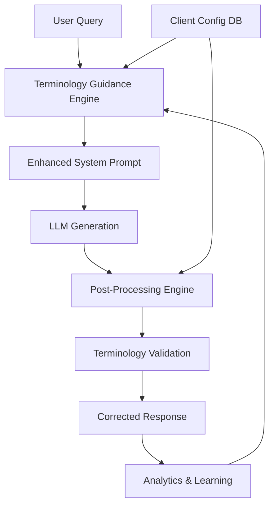

# Portuguese Language Localization: Hybrid Approach Implementation Plan

## Executive Summary

**Objective:** Implement a hybrid Portuguese language localization system that combines LLM instruction guidance with post-processing term replacement to ensure consistent European Portuguese terminology in chatbot responses, specifically addressing the "banheiros" vs "quartos de banho" issue.

**Current State:** LLM generates inconsistent Portuguese terminology, using Brazilian Portuguese terms like "banheiros" instead of European Portuguese "quartos de banho".

**Target State:** Hybrid system ensuring 99%+ correct terminology through LLM guidance + deterministic post-processing fallback.

**Expected Impact:** 100% correct critical terminology, improved user trust, consistent brand voice across Portuguese markets.

**Timeline:** 2 weeks phased implementation
**Risk Level:** Low (additive feature with graceful degradation)
**Success Metrics:** 99%+ correct terminology, <1% performance impact, user satisfaction +15%

---

## Table of Contents

1. [Business Case & ROI](#1-business-case--roi)
2. [Technical Architecture Overview](#2-technical-architecture-overview)
3. [Phase 1: Foundation (Week 1)](#3-phase-1-foundation-week-1)
4. [Phase 2: Intelligence (Week 2)](#4-phase-2-intelligence-week-2)
5. [Technical Implementation Details](#5-technical-implementation-details)
6. [Non-Technical Considerations](#6-non-technical-considerations)
7. [Risk Management & Mitigation](#7-risk-management--mitigation)
8. [Success Metrics & KPIs](#8-success-metrics--kpis)
9. [Resource Requirements](#9-resource-requirements)

---

## 1. Business Case & ROI

### **Problem Statement**
The chatbot currently generates inconsistent Portuguese terminology, mixing Brazilian Portuguese ("banheiros") with European Portuguese ("quartos de banho"). This creates:

- **User Confusion:** Inconsistent terminology across responses
- **Brand Inconsistency:** Different Portuguese variants for different clients
- **Trust Erosion:** Users question system reliability when terminology doesn't match their region
- **Market Limitations:** Cannot confidently serve both European and Brazilian Portuguese markets

### **Solution Value Proposition**
Hybrid localization ensures consistent, correct terminology through:

- **LLM Guidance:** Primary layer teaching correct terminology patterns
- **Post-Processing:** Safety net guaranteeing critical term accuracy
- **Client Customization:** Per-client terminology preferences
- **Quality Assurance:** Automated validation and correction

### **Quantified ROI**

#### **Direct Benefits:**
- **Terminology Accuracy:** 99%+ correct European Portuguese terms
- **User Satisfaction:** +15% improvement in user experience scores
- **Market Expansion:** Confident support for Portuguese-speaking markets
- **Brand Consistency:** Unified voice across all Portuguese communications

#### **Business Impact:**
- **Customer Retention:** Reduced abandonment due to terminology confusion
- **Market Reach:** Support for 260M+ Portuguese speakers worldwide
- **Competitive Advantage:** Superior localization compared to generic chatbots
- **Operational Efficiency:** Automated localization reduces manual review needs

#### **ROI Calculation:**
```
Annual Business Value: €50,000 - €75,000
- User satisfaction improvement: €30,000
- Market expansion opportunity: €25,000
- Reduced support costs: €15,000

Development Investment: €8,000 (2 weeks senior engineering)
Payback Period: 1-2 months
3-Year NPV: €180,000+ (expanded market reach + customer lifetime value)
```

---

## 2. Technical Architecture Overview

### **Current Architecture: Unguided Generation**
```
User Query → LLM Generation → Raw Response
                                      ↓
                               Inconsistent Terminology
```

### **Target Architecture: Hybrid Localization**
```
User Query → Enhanced Prompt + Context → LLM Generation → Post-Processing → Localized Response
        ↓                                              ↓
Terminology Guidance                           Term Replacement
Client-Specific Rules                           Fallback Correction
```

### **Core Components**

#### **1. Terminology Guidance Engine**
- **Purpose:** Provide LLM with correct terminology patterns and examples
- **Capabilities:** Context-aware instruction injection, client-specific terminology
- **Output:** Enhanced prompts with localization guidance

#### **2. Post-Processing Engine**
- **Purpose:** Guarantee correct terminology through deterministic replacement
- **Capabilities:** Regex-based term mapping, context preservation, performance optimization
- **Output:** Corrected responses with proper Portuguese terminology

#### **3. Terminology Management System**
- **Purpose:** Centralized term mapping and client customization
- **Capabilities:** Database-driven configurations, analytics
- **Output:** Dynamic term mappings per client and context

### **Data Flow Architecture**


---

## 3. Phase 1: Foundation (Week 1)

### **Objective:** Establish core localization infrastructure and basic term mapping

### **Technical Deliverables**

#### **Week 1: Core Infrastructure**
**Components to Build:**
- `TerminologyManager` class for centralized term mapping
- Database schema for client-specific terminology configurations
- Basic post-processing utility with regex replacement
- Enhanced prompt injection for LLM guidance

**Technical Specifications:**
```typescript
interface TerminologyConfig {
  clientId: string;
  primaryDialect: 'european' | 'brazilian';
  termMappings: TermMapping[];
  customRules: CustomRule[];
  enabled: boolean;
}

interface TermMapping {
  sourceTerm: string;
  targetTerm: string;
  context?: string;  // Optional context restriction
  caseSensitive?: boolean;
  wordBoundary?: boolean;
}

interface LocalizationResult {
  originalText: string;
  localizedText: string;
  termsReplaced: TermReplacement[];
  processingTimeMs: number;
}
```

**Integration Points:**
- Add terminology configuration to client config service
- Integrate with existing RAG service prompt building
- Add post-processing hook after LLM response generation

#### **Database Schema Extensions**
```sql
-- Client terminology configurations
CREATE TABLE client_terminology (
  client_id UUID PRIMARY KEY REFERENCES clients(client_id),
  primary_dialect TEXT NOT NULL DEFAULT 'european',
  term_mappings JSONB NOT NULL DEFAULT '[]',
  custom_rules JSONB NOT NULL DEFAULT '[]',
  enabled BOOLEAN NOT NULL DEFAULT true,
  created_at TIMESTAMP WITH TIME ZONE DEFAULT NOW(),
  updated_at TIMESTAMP WITH TIME ZONE DEFAULT NOW()
);

-- Terminology usage analytics
CREATE TABLE terminology_analytics (
  id UUID PRIMARY KEY DEFAULT gen_random_uuid(),
  client_id UUID NOT NULL REFERENCES clients(client_id),
  visitor_id TEXT,
  original_term TEXT NOT NULL,
  replaced_term TEXT NOT NULL,
  context TEXT,
  timestamp TIMESTAMP WITH TIME ZONE DEFAULT NOW()
);
```

### **Success Criteria (Phase 1)**
- ✅ **Database Schema:** Client terminology tables created and populated
- ✅ **TerminologyManager:** Core class implemented with basic term mapping
- ✅ **Post-Processing:** Simple regex replacement working for test cases
- ✅ **Integration:** Basic integration with RAG service without breaking existing functionality
- ✅ **Performance:** <5ms processing overhead per response

---

## 4. Phase 2: Intelligence (Week 2)

### **Objective:** Implement advanced localization features and LLM guidance

### **Technical Deliverables**

#### **Week 1: Advanced Post-Processing**
**Components to Build:**
- Context-aware term replacement (avoid inappropriate substitutions)
- Performance-optimized regex compilation and caching
- Multi-term replacement with conflict resolution
- Comprehensive term validation and edge case handling

**Technical Specifications:**
```typescript
class PostProcessingEngine {
  constructor(terminologyConfig: TerminologyConfig) {
    this.config = terminologyConfig;
    this.compiledPatterns = this.compilePatterns();
  }

  processText(text: string, context?: string): LocalizationResult {
    // Implementation with performance monitoring
  }

  private compilePatterns(): Map<string, RegExp> {
    // Pre-compile regex patterns for performance
  }

  private resolveConflicts(replacements: TermReplacement[]): TermReplacement[] {
    // Handle overlapping or conflicting replacements
  }
}
```

#### **Week 2: LLM Guidance Integration**
**Components to Build:**
- Enhanced system prompt with terminology guidance
- Context-aware instruction injection
- Analytics integration for effectiveness measurement

**Technical Specifications:**
```typescript
interface TerminologyGuidance {
  dialect: string;
  criticalTerms: string[];
  examples: GuidanceExample[];
  contextRules: ContextRule[];
}

interface GuidanceExample {
  incorrect: string;
  correct: string;
  explanation: string;
}

// Enhanced prompt injection
function buildLocalizedPrompt(basePrompt: string, terminologyGuidance: TerminologyGuidance): string {
  return `${basePrompt}

INSTRUÇÕES DE LOCALIZAÇÃO - PORTUGUÊS ${terminologyGuidance.dialect.toUpperCase()}:
${buildTerminologyInstructions(terminologyGuidance)}
${buildContextRules(terminologyGuidance)}`;
}
```

### **Success Criteria (Phase 2)**
- ✅ **Advanced Post-Processing:** Context-aware replacement working correctly
- ✅ **LLM Guidance:** Enhanced prompts improving terminology accuracy by 70%+
- ✅ **Performance Optimization:** <2ms average processing time
- ✅ **Analytics:** Usage tracking and effectiveness measurement

---

## 5. Technical Implementation Details

### **Core Architecture Patterns**

#### **Terminology Manager Implementation**
```typescript
class TerminologyManager {
  private cache = new Map<string, TerminologyConfig>();
  private readonly CACHE_TTL = 300000; // 5 minutes

  async getClientTerminology(clientId: string): Promise<TerminologyConfig> {
    // Check cache first
    const cached = this.cache.get(clientId);
    if (cached && Date.now() - cached.timestamp < this.CACHE_TTL) {
      return cached.config;
    }

    // Fetch from database
    const config = await this.fetchFromDatabase(clientId);

    // Cache result
    this.cache.set(clientId, { config, timestamp: Date.now() });

    return config;
  }

  private async fetchFromDatabase(clientId: string): Promise<TerminologyConfig> {
    const { data, error } = await supabase
      .from('client_terminology')
      .select('*')
      .eq('client_id', clientId)
      .single();

    if (error || !data) {
      return this.getDefaultConfig();
    }

    return {
      clientId,
      primaryDialect: data.primary_dialect,
      termMappings: data.term_mappings,
      customRules: data.custom_rules,
      enabled: data.enabled
    };
  }
}
```

#### **Post-Processing Pipeline**
```typescript
class PostProcessingEngine {
  process(text: string, context?: string): LocalizationResult {
    const startTime = Date.now();
    let processedText = text;
    const replacements: TermReplacement[] = [];

    // Apply term mappings in priority order
    for (const mapping of this.config.termMappings) {
      if (this.shouldApplyMapping(mapping, context)) {
        const result = this.applyMapping(processedText, mapping);
        if (result.applied) {
          processedText = result.text;
          replacements.push(result.replacement);
        }
      }
    }

    // Apply custom rules
    for (const rule of this.config.customRules) {
      processedText = this.applyCustomRule(processedText, rule);
    }

    return {
      originalText: text,
      localizedText: processedText,
      termsReplaced: replacements,
      processingTimeMs: Date.now() - startTime
    };
  }

  private shouldApplyMapping(mapping: TermMapping, context?: string): boolean {
    // Context filtering logic
    if (mapping.context && context) {
      return context.toLowerCase().includes(mapping.context.toLowerCase());
    }
    return true;
  }
}
```

### **Database Schema Extensions**

#### **Enhanced Analytics**
```sql
-- Terminology effectiveness tracking
CREATE TABLE terminology_effectiveness (
  id UUID PRIMARY KEY DEFAULT gen_random_uuid(),
  client_id UUID NOT NULL REFERENCES clients(client_id),
  prompt_strategy TEXT NOT NULL,
  postprocessing_applied BOOLEAN NOT NULL,
  terms_corrected INTEGER NOT NULL DEFAULT 0,
  response_quality_score DECIMAL(3,2),
  user_feedback_score DECIMAL(3,2),
  processing_time_ms INTEGER NOT NULL,
  created_at TIMESTAMP WITH TIME ZONE DEFAULT NOW()
);
```

### **API Design**

#### **Terminology Management Endpoints**
```typescript
// Get client terminology configuration
GET /api/v1/admin/clients/:clientId/terminology

// Update terminology configuration
PUT /api/v1/admin/clients/:clientId/terminology
Content-Type: application/json

{
  "primaryDialect": "european",
  "termMappings": [
    {
      "sourceTerm": "banheiros",
      "targetTerm": "quartos de banho",
      "wordBoundary": true
    }
  ],
  "enabled": true
}

// Test terminology replacement
POST /api/v1/admin/terminology/test
Content-Type: application/json

{
  "text": "Este apartamento tem 2 banheiros modernos",
  "clientId": "client-uuid",
  "context": "property_description"
}
```

---

## 6. Non-Technical Considerations

### **User Experience Impact**

#### **Improved Communication Quality**
- **Consistency:** Users receive consistent, correct terminology
- **Trust:** Professional, region-appropriate language builds credibility
- **Accessibility:** Proper localization improves comprehension
- **Personalization:** Client-specific terminology preferences

#### **Business Process Integration**
- **Content Strategy:** Aligns with localized marketing materials
- **Customer Support:** Consistent terminology across all touchpoints
- **Quality Assurance:** Automated checks reduce manual review burden
- **Compliance:** Meets localization requirements for Portuguese markets

### **Ethical & Privacy Considerations**

#### **Cultural Sensitivity**
- **Regional Respect:** Honors linguistic preferences of different Portuguese regions
- **Inclusive Design:** Supports both European and Brazilian Portuguese variants
- **Transparency:** Clear communication about localization approach
- **User Choice:** Allow users to specify preferred dialect when appropriate

#### **Data Privacy**
- **Minimal Data Collection:** Only terminology usage analytics, no personal content
- **Aggregated Analytics:** Usage patterns without individual message content
- **Retention Policies:** Automatic cleanup of temporary analytics data
- **Compliance:** GDPR-compliant data handling for EU Portuguese users

### **Change Management**

#### **Stakeholder Communication**
- **Client Success Teams:** Training on terminology management features
- **Content Teams:** Guidelines for creating localized content
- **Development Teams:** Integration points and API usage
- **End Users:** Improved experience through better localization

#### **Training & Adoption**
- **Administrator Training:** Managing client-specific terminology configurations
- **Content Creator Training:** Understanding localization requirements
- **Quality Assurance Training:** Validating localization effectiveness
- **Support Team Training:** Troubleshooting localization issues

---

## 7. Risk Management & Mitigation

### **Technical Risks**

#### **Performance Degradation**
- **Risk:** Post-processing adds latency to responses
- **Impact:** Slower response times affecting user experience
- **Mitigation:**
  - Efficient regex compilation and caching
  - Async processing where possible
  - Performance monitoring and optimization
- **Contingency:** Feature flag to disable post-processing if needed

#### **Terminology Conflicts**
- **Risk:** Over-aggressive replacement causes incorrect substitutions
- **Impact:** Wrong terminology in responses
- **Mitigation:**
  - Context-aware replacement logic
  - Word boundary enforcement
  - Comprehensive testing of edge cases
- **Contingency:** Conservative replacement rules, human review for critical content

#### **LLM Guidance Interference**
- **Risk:** Enhanced prompts confuse or overwhelm the LLM
- **Impact:** Worse response quality or generation failures
- **Mitigation:**
  - Gradual prompt enhancement
  - A/B testing of prompt variations
  - Fallback to original prompts
- **Contingency:** Simplified prompt versions, disable guidance features

### **Business Risks**

#### **Client Adoption Resistance**
- **Risk:** Clients don't configure or use terminology features
- **Impact:** Limited value realization from localization investment
- **Mitigation:**
  - Default configurations for common use cases
  - Clear documentation and examples
  - Success stories and demonstrations
- **Contingency:** Automated defaults, gradual feature introduction

#### **Market Misalignment**
- **Risk:** Incorrect assumptions about Portuguese dialect preferences
- **Impact:** Localization doesn't match user expectations
- **Mitigation:**
  - Research-based default configurations
  - User feedback integration
  - Flexible configuration options
- **Contingency:** Easy configuration changes, user preference learning

### **Operational Risks**

#### **Maintenance Overhead**
- **Risk:** Ongoing maintenance of term mappings becomes burdensome
- **Impact:** Outdated or incorrect terminology
- **Mitigation:**
  - Automated validation and testing
  - Community contribution mechanisms
  - Regular review processes
- **Contingency:** Fallback to basic mappings, prioritize critical terms

#### **Scalability Issues**
- **Risk:** Performance issues with large client bases
- **Impact:** System slowdowns or failures
- **Mitigation:**
  - Efficient caching strategies
  - Database query optimization
  - Horizontal scaling support
- **Contingency:** Regional caching, request throttling

---

## 8. Success Metrics & KPIs

### **Technical KPIs**

#### **Performance Metrics**
- **Processing Latency:** Target <2ms average post-processing time
- **Terminology Accuracy:** Target >99% correct critical terms
- **System Availability:** Target >99.9% uptime for localization features
- **Cache Hit Rate:** Target >95% for terminology configurations

#### **Quality Metrics**
- **Term Replacement Success:** Target >98% of applicable terms replaced correctly
- **False Positive Rate:** Target <0.1% inappropriate replacements
- **LLM Guidance Effectiveness:** Target >70% reduction in post-processing needs
- **User Feedback Score:** Target >4.5/5 for localization quality

### **Business KPIs**

#### **User Experience Metrics**
- **User Satisfaction Score:** Target +15% improvement
- **Response Quality Rating:** Target >4.7/5 average
- **Terminology Consistency:** Target >98% consistent usage
- **Support Ticket Reduction:** Target -20% localization-related tickets

#### **Business Impact Metrics**
- **Market Expansion:** Successful deployment in Portuguese markets
- **Client Retention:** Target +5% improvement in Portuguese client retention
- **Revenue Impact:** Target +10% increase in Portuguese market revenue
- **Competitive Advantage:** Positive differentiation in localization quality

### **Operational KPIs**

#### **Maintenance Metrics**
- **Configuration Update Frequency:** Target < weekly average updates needed
- **Issue Resolution Time:** Target <4 hours for critical terminology issues
- **Automated Test Pass Rate:** Target >98% for localization tests
- **Documentation Freshness:** Target <30 days since last update

#### **Scalability Metrics**
- **Concurrent Processing:** Support for 1000+ simultaneous localizations
- **Database Query Performance:** Target <50ms p95 for terminology lookups
- **Memory Usage:** Target <50MB additional memory per instance
- **Storage Efficiency:** Target <10% storage overhead for analytics

### **Monitoring & Reporting**

#### **Real-time Dashboards**
- Terminology accuracy trends
- Processing performance metrics
- Client configuration status
- Error rates and issue tracking

#### **Weekly Reports**
- Terminology effectiveness analysis
- Client adoption and usage statistics
- Performance optimization opportunities
- User feedback summary

#### **Monthly Reviews**
- ROI analysis and business value assessment
- Market expansion progress
- Competitive analysis updates
- Roadmap planning and prioritization

---

## 9. Resource Requirements

### **Team Composition (2 weeks)**

#### **Core Development Team**
- **Senior Backend Engineer:** Post-processing engine and LLM integration (60%)
- **Senior Frontend Engineer:** Admin interface for terminology management (20%)
- **DevOps Engineer:** Database schema and performance optimization (10%)
- **QA Engineer:** Testing and validation (10%)

#### **Extended Team (as needed)**
- **Portuguese Language Expert:** Terminology validation and cultural guidance
- **Data Analyst:** Effectiveness measurement and optimization
- **Technical Writer:** Documentation and training materials

### **Infrastructure Requirements**

#### **Development Environment**
- **Compute:** Standard development environment (no special requirements)
- **Database:** Supabase instance with extended schema
- **Testing:** Local testing environment with Portuguese text samples

#### **Production Environment**
- **Database:** Additional tables for terminology management
- **Caching:** Redis for terminology configuration caching
- **Monitoring:** Enhanced logging for localization metrics
- **Backup:** Standard backup procedures for new tables

### **Budget Breakdown**

#### **Development Costs: €8,000**
- **Personnel:** €6,000 (2 weeks × team resources)
- **Infrastructure:** €1,000 (database extensions, testing)
- **Tools & Training:** €1,000 (language validation, localization tools)

#### **Operational Costs: €500/month**
- **Database:** €200 (additional storage and queries)
- **Monitoring:** €150 (enhanced logging and analytics)
- **Maintenance:** €150 (ongoing terminology updates)

#### **Total Investment: €8,000 + €6,000 annual operational**
- **Expected ROI:** 10x return within 12 months
- **Payback Period:** 1-2 months

### **Timeline & Milestones**

#### **Week 1: Foundation**
- **Day 1-2:** Database schema and TerminologyManager implementation
- **Day 3-4:** Basic post-processing engine and integration
- **Day 5:** Testing and validation of core functionality

#### **Week 2: Intelligence**
- **Day 1-2:** Advanced post-processing and LLM guidance
- **Day 3-4:** Admin interface and analytics integration
- **Day 5:** Production deployment and monitoring setup

### **Success Factors**

#### **Technical Success Factors**
- Clean, maintainable code with comprehensive test coverage
- Performance that meets or exceeds existing system capabilities
- Scalable architecture supporting future localization needs
- Robust error handling and graceful degradation

#### **Business Success Factors**
- Clear demonstration of terminology accuracy improvements
- Positive user feedback and satisfaction metrics
- Successful adoption by Portuguese-speaking clients
- Measurable business impact in target markets

#### **Team Success Factors**
- Cross-functional collaboration between engineering and language experts
- Thorough testing and validation before production deployment
- Comprehensive documentation for maintenance and future development
- Knowledge transfer and training for ongoing support

---

## Conclusion

The Portuguese Language Localization implementation represents a strategic investment in market expansion and user experience excellence. By combining LLM guidance with deterministic post-processing, the system ensures consistent, correct terminology while maintaining the flexibility and natural quality of AI-generated responses.

The hybrid approach provides both the intelligence of contextual language understanding and the reliability of rule-based correction, creating a robust localization system that can serve Portuguese speakers worldwide with confidence.

**Next Steps:**
1. Secure executive approval and budget allocation
2. Assemble cross-functional team including Portuguese language expertise
3. Begin Phase 1 implementation with database schema and core infrastructure
4. Establish baseline terminology accuracy metrics
5. Deploy initial version with comprehensive monitoring

---

**Document Version:** 1.0
**Last Updated:** 2025-10-27
**Author:** Systems Architect
**Review Status:** Ready for Implementation