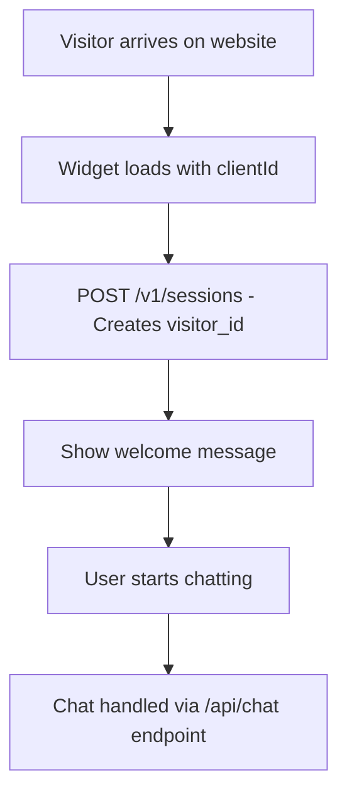

# Product Requirements Document: Onboarding Questions Feature

## 1. Executive Summary

### Overview
This PRD outlines the implementation of an onboarding questions feature for the Enterprise RAG Chatbot Platform. The feature will automatically present new visitors with personalized questions in Portuguese to understand their property preferences, enabling the chatbot to provide highly targeted property recommendations.

### Business Objectives
- **Improve Lead Qualification**: Gather specific visitor preferences upfront to enhance lead scoring
- **Personalize Recommendations**: Use onboarding data to provide relevant property suggestions
- **Increase Engagement**: Create a more interactive and helpful first experience
- **Enable Client Customization**: Allow real estate agencies to customize onboarding questions per their market

## 2. Current System Analysis

### Existing Infrastructure
- **Visitor Management**: Visitors identified by `visitor_id` in Supabase `visitors` table
- **Client Configuration**: Multi-tenant system with client-specific settings in `clients` table
- **RAG Integration**: Template variable `{onboardingAnswers}` already implemented in RAG system
- **Admin Dashboard**: Existing client management interface for configuration
- **Widget Architecture**: Preact-based embeddable widget with session management

### Current Visitor Flow


## 3. Feature Requirements

### 3.1 Core Functionality

#### 3.1.1 New Visitor Detection
- **Requirement**: Automatically detect first-time visitors
- **Implementation**: Check if visitor has `onboarding_completed = false` in database
- **Trigger**: When new visitor session is created or on first chat interaction

#### 3.1.2 Onboarding Questions Flow
- **Language**: All questions in Portuguese (Portugal)
- **Presentation**: Modal overlay or chat-based questionnaire
- **Questions Include**:
  1. **Tipologia** (Property Type): T0, T1, T2, T3, T4+, Moradia, Comercial
  2. **Orçamento** (Budget): Ranges in EUR (e.g., <150k, 150k-300k, 300k-500k, 500k+)
  3. **Objetivo** (Purpose): Habitação própria, Investimento, Ambos
  4. **Prazo** (Timeline): Imediato, 3-6 meses, 6-12 meses, +12 meses
  5. **Localização** (Location): Distrito/Concelho preferences
  6. **Características** (Features): Varanda, Garagem, Elevador, etc.

#### 3.1.3 Response Storage
- **Storage**: Answers stored as JSON in `visitors.onboarding_questions` field
- **Completion Flag**: `onboarding_completed` boolean field
- **Update Capability**: Visitors can update preferences later

### 3.2 Client Customization

#### 3.2.1 Default Questions Template
- **Portuguese Property Market Focus**: Default questions optimized for Portuguese real estate
- **Customizable per Client**: Each client can modify questions in admin dashboard
- **Question Types**: Multiple choice, ranges, checkboxes, text input
- **Conditional Logic**: Support for follow-up questions based on previous answers

#### 3.2.2 Admin Dashboard Integration
- **Location**: New section in client edit form
- **Editor Interface**: JSON editor with visual preview
- **Template System**: Load default Portuguese real estate template
- **Validation**: Ensure proper question format and required fields

### 3.3 RAG Integration

#### 3.3.1 Personalized Responses
- **Template Variable**: Utilize existing `{onboardingAnswers}` in system prompts
- **Context Enhancement**: Include preferences in every chat response
- **Recommendation Engine**: Generate targeted property suggestions
- **Progressive Enhancement**: Refine recommendations as conversation progresses

## 4. Technical Architecture

### 4.1 Database Schema Changes

#### 4.1.1 Visitors Table Updates
```sql
ALTER TABLE visitors
ADD COLUMN IF NOT EXISTS onboarding_questions JSONB,
ADD COLUMN IF NOT EXISTS onboarding_completed BOOLEAN DEFAULT FALSE;
```

#### 4.1.2 Clients Table Updates
```sql
ALTER TABLE clients
ADD COLUMN IF NOT EXISTS default_onboarding_questions JSONB;
```

### 4.2 API Endpoints

#### 4.2.1 New Endpoints
- `GET /v1/visitors/{visitorId}/onboarding` - Get onboarding status and questions
- `POST /v1/visitors/{visitorId}/onboarding` - Submit onboarding answers
- `PUT /v1/visitors/{visitorId}/onboarding` - Update existing answers
- `GET /v1/clients/{clientId}/onboarding-template` - Get client's onboarding questions
- `PUT /v1/clients/{clientId}/onboarding-template` - Update client's onboarding questions

#### 4.2.2 Enhanced Endpoints
- `POST /v1/sessions` - Include onboarding status in response
- `POST /api/chat` - Enhanced to trigger onboarding if not completed

### 4.3 Widget Implementation

#### 4.3.1 Onboarding Modal Component
- **Framework**: Preact component integrated into existing widget
- **Design**: Modal overlay with step-by-step questionnaire
- **Accessibility**: Full keyboard navigation and screen reader support
- **Responsive**: Mobile-optimized design

#### 4.3.2 State Management
- **Local State**: Track current question, answers, and completion status
- **Persistence**: Automatically save answers to backend
- **Recovery**: Resume onboarding if interrupted

### 4.4 Admin Dashboard Enhancement

#### 4.4.1 Onboarding Questions Editor
- **Location**: New tab in EditClientForm component
- **Interface**: Visual question builder with JSON export
- **Preview**: Live preview of onboarding flow
- **Templates**: Pre-built templates for different property markets

## 5. Default Portuguese Questions Template

### 5.1 Question Structure
```json
{
  "questions": [
    {
      "id": "tipologia",
      "type": "multiple_choice",
      "question": "Que tipo de imóvel procura?",
      "options": [
        { "value": "T0", "label": "T0 - Estúdio" },
        { "value": "T1", "label": "T1 - 1 Quarto" },
        { "value": "T2", "label": "T2 - 2 Quartos" },
        { "value": "T3", "label": "T3 - 3 Quartos" },
        { "value": "T4+", "label": "T4+ - 4 ou mais Quartos" },
        { "value": "moradia", "label": "Moradia" },
        { "value": "comercial", "label": "Comercial" }
      ],
      "required": true
    },
    {
      "id": "orcamento",
      "type": "range_select",
      "question": "Qual o seu orçamento?",
      "options": [
        { "value": "<150k", "label": "Até 150.000€" },
        { "value": "150k-300k", "label": "150.000€ - 300.000€" },
        { "value": "300k-500k", "label": "300.000€ - 500.000€" },
        { "value": "500k-750k", "label": "500.000€ - 750.000€" },
        { "value": ">750k", "label": "Mais de 750.000€" }
      ],
      "required": true
    },
    {
      "id": "objetivo",
      "type": "multiple_choice",
      "question": "Qual o objetivo da compra?",
      "options": [
        { "value": "habitacao", "label": "Habitação Própria" },
        { "value": "investimento", "label": "Investimento" },
        { "value": "ambos", "label": "Ambos" }
      ],
      "required": true
    },
    {
      "id": "prazo",
      "type": "multiple_choice",
      "question": "Em que prazo pretende comprar?",
      "options": [
        { "value": "imediato", "label": "Imediatamente" },
        { "value": "3-6meses", "label": "3-6 meses" },
        { "value": "6-12meses", "label": "6-12 meses" },
        { "value": "+12meses", "label": "Mais de 12 meses" }
      ],
      "required": true
    },
    {
      "id": "localizacao",
      "type": "text_input",
      "question": "Onde prefere que seja localizado o imóvel? (Concelho, Distrito)",
      "placeholder": "Ex: Lisboa, Porto, Cascais...",
      "required": false
    },
    {
      "id": "caracteristicas",
      "type": "multiple_select",
      "question": "Que características considera importantes?",
      "options": [
        { "value": "varanda", "label": "Varanda/Terraço" },
        { "value": "garagem", "label": "Garagem" },
        { "value": "elevador", "label": "Elevador" },
        { "value": "piscina", "label": "Piscina" },
        { "value": "jardim", "label": "Jardim" },
        { "value": "vista_mar", "label": "Vista Mar" },
        { "value": "centro_cidade", "label": "Centro da Cidade" },
        { "value": "transportes", "label": "Perto de Transportes" }
      ],
      "required": false
    }
  ],
  "completion_message": "Obrigado! Com base nas suas preferências, posso agora ajudá-lo a encontrar o imóvel perfeito.",
  "skip_option": "Continuar sem responder"
}
```

## 6. Implementation Phases

### Phase 1: Database and Backend APIs
1. Update database schema
2. Create onboarding API endpoints
3. Update visitor service for onboarding status
4. Test API endpoints

### Phase 2: Widget Enhancement
1. Create onboarding modal component
2. Integrate with existing widget
3. Implement state management
4. Add accessibility features

### Phase 3: Admin Dashboard
1. Create onboarding questions editor
2. Add to client edit form
3. Implement template system
4. Add validation and preview

### Phase 4: RAG Integration
1. Enhance system prompts with onboarding context
2. Update response generation logic
3. Test personalized recommendations
4. Fine-tune based on feedback

## 7. Success Metrics

### 7.1 User Engagement
- **Onboarding Completion Rate**: Target >70%
- **Chat Engagement Post-Onboarding**: 30% increase in messages per session
- **Session Duration**: 25% increase in average session time

### 7.2 Lead Quality
- **Lead Score Improvement**: 20% higher average lead scores for onboarded visitors
- **Conversion Rate**: 15% increase in conversion actions
- **Relevant Recommendations**: 90% of responses include relevant property suggestions

### 7.3 Client Adoption
- **Configuration Usage**: 80% of clients customize default questions
- **Feature Satisfaction**: >4.5/5 rating from client feedback
- **Support Requests**: <5% of clients require support for onboarding setup

## 8. Risk Mitigation

### 8.1 Technical Risks
- **Database Migration**: Gradual rollout with fallback options
- **Widget Performance**: Lazy loading and optimization
- **Mobile Compatibility**: Extensive mobile testing

### 8.2 User Experience Risks
- **Onboarding Fatigue**: Optional questions and skip functionality
- **Language Localization**: Professional Portuguese translation review
- **Accessibility**: WCAG compliance testing

### 8.3 Business Risks
- **Client Adoption**: Comprehensive documentation and training
- **Data Privacy**: GDPR compliance for preference storage
- **Performance Impact**: Load testing and monitoring

## 9. Future Enhancements

### 9.1 Advanced Features
- **Conditional Logic**: Dynamic questions based on previous answers
- **Machine Learning**: AI-powered question optimization
- **Multi-language Support**: Expand beyond Portuguese
- **Advanced Analytics**: Onboarding completion funnel analysis

### 9.2 Integration Opportunities
- **CRM Integration**: Export onboarding data to client CRMs
- **Email Marketing**: Trigger personalized email campaigns
- **Property Matching**: Direct integration with property databases
- **Lead Scoring Enhancement**: Weight onboarding answers in scoring algorithm

## 10. Acceptance Criteria

### 10.1 Core Functionality
- [ ] New visitors automatically see onboarding questions
- [ ] Questions are presented in Portuguese
- [ ] Answers are saved to visitor record
- [ ] Onboarding can be skipped
- [ ] Preferences influence chatbot responses
- [ ] Visitors can update preferences later

### 10.2 Admin Features
- [ ] Clients can customize onboarding questions
- [ ] Default Portuguese template is available
- [ ] Questions can be previewed before saving
- [ ] Changes take effect immediately for new visitors

### 10.3 Technical Requirements
- [ ] Mobile-responsive design
- [ ] Accessibility compliant
- [ ] Performance impact <100ms
- [ ] 99.9% uptime maintained
- [ ] GDPR compliant data handling

---

*This PRD serves as the blueprint for implementing onboarding questions to enhance visitor engagement and lead qualification in the Enterprise RAG Chatbot Platform.*